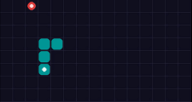
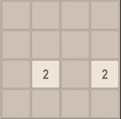
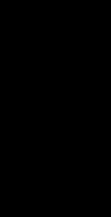
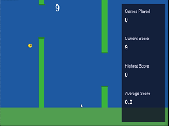
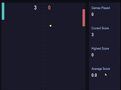
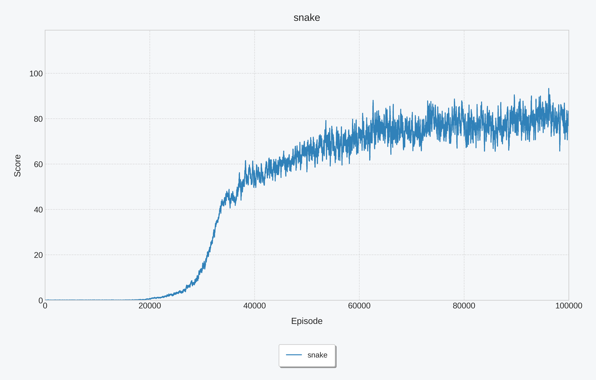
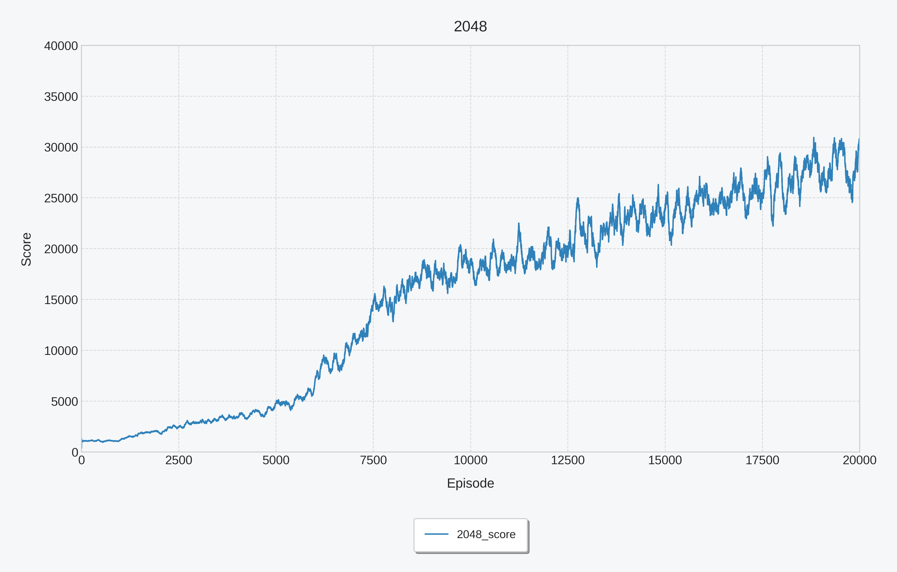
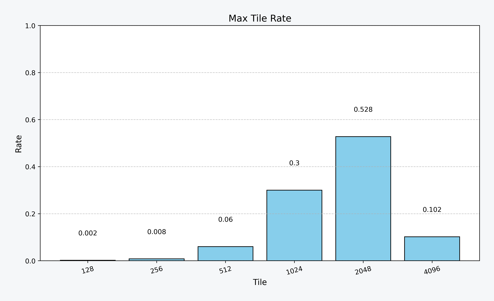
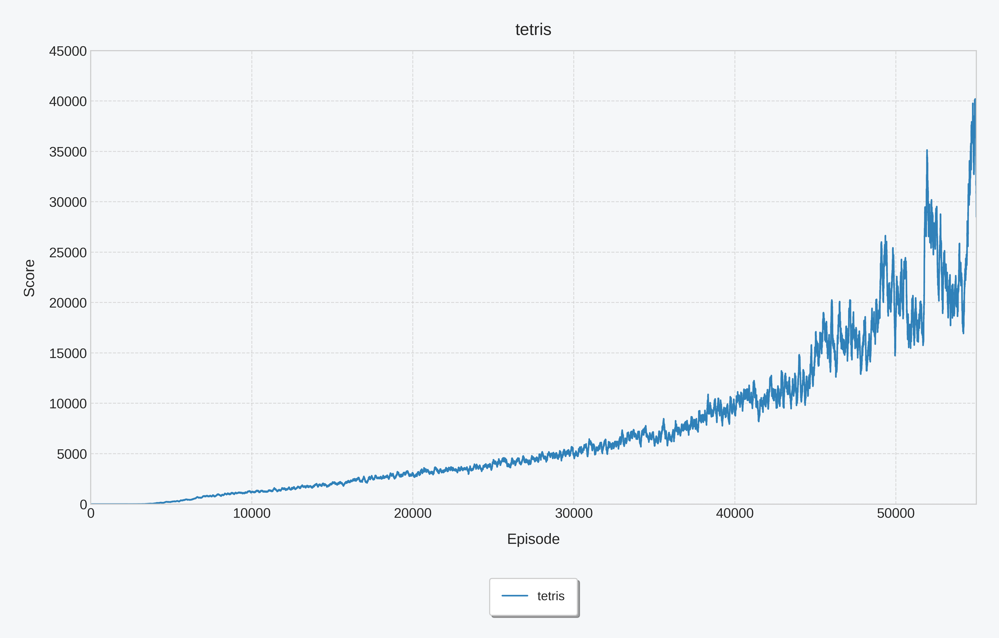

# MystRL

MystRL is a simple Python implementation of reinforcement learning from scratch.

   

### DQN

**DQN** (Deep Q-Network) is a reinforcement learning algorithm that uses a deep neural network to make an agent's decisions. Instead of storing all possible states and actions in a traditional Q-table, DQN uses a neural network to estimate the value (Q-value) of each action from a given state, allowing it to handle complex environments like video games.

To make the learning process stable, DQN uses two main techniques:

- Experience Replay: It stores the agent's past experiences (state, action, reward, next state) in a memory buffer and randomly samples from it to train the network. This breaks the correlation between consecutive experiences.
- Target Network: It uses a second, separate network to set the training targets. This "target network" is updated less frequently than the main network, which helps prevent the model from becoming unstable during training.

#### Snake 

Snake is a fundamentally simple yet thrilling challenge where players guide a continuously moving line across a grid. The objective is to navigate the snake, using directional controls to collect food items like pellets or apples, each consumed piece causing the snake to grow longer. Success requires quick reflexes and careful planning, as the primary danger comes from the snake itself: colliding with any part of its own ever-lengthening body instantly ends the game. This creates an escalating challenge, where the very act of growing and progressing makes maneuvering in the confined space increasingly perilous.

The reward function can be written as:

$$
r(s,a) = 
\begin{cases}
  1 & \text{eat food} \\
  -15 & \text{dead} \\
  0 & \text{otherwise} \\
\end{cases}
$$

The **moving average reward curve (over a sliding window of 100 games)** during training is visualized as follows:

After training, the test results are as follows (conducted on 500 games):

| Total Games | Board Size | Average Score | Success Rate    |
| ----------- | ---------- | ------------- | --------------- |
| 500         | 15 x 8     | 90.97         | 40.4% (202/500) |

##### How To Test

python game_snake.py --mode test --min_eps -1 --model_path model/snake/episode-100000/model_weights --render_mode gui --speed 10

Add --device cuda if you have a GPU available.

##### How To Train 

python game_snake.py --mode train --device cuda --task_name snake --save_path model/snake --min_eps 0.001 --lr 2e-4 --min_lr 1e-5 --total_decay_episodes 20000 --batch_size 16 --save_every_episodes 2000 --decay_rate 200000 --min_train_buffer_size 100000 --buffer_size 10000000 --n_last_frames 4 --target_update_frequency 10000  --lr_scheduler cosine

#### 2048

2048 is a deceptively simple yet compelling puzzle game played on a 4x4 grid. Players slide numbered tiles in any of the four directions, causing matching tiles to merge into a new tile with their combined value. The core objective is to strategically combine doubles to create ever-larger numbers, ultimately aiming to form the elusive 2048 tile before the grid becomes too crowded. Each move introduces a new low-value tile (usually a '2' or '4'), constantly challenging players to balance their progress against the increasingly filled board.

The reward function can be written as:

$$
r(s,a) = 
\begin{cases}
  -100 & \text{invalid move} \\
  \alpha*\sum_{x\in\text{merged tiles}}\log_2(x) + \beta*N_{zeros}& \text{otherwise} \\
\end{cases}
$$

The **moving average reward curve (over a sliding window of 100 games)** during training is visualized as follows:

After training, the test results are as follows (conducted on 500 games):

| Total Games | Average Score | Success Rate(>=2048 Rate) |
| ----------- | ------------- | ------------------------- |
| 500         | 29630         | 0.63                      |

##### How To Test

python game_2048.py --mode test --min_eps -1 --model_path model/2048/episode-20000/model_weights --render_mode gui

Add --device cuda if you have a GPU available.

##### How To Train 

python game_2048.py --mode train --device cuda --task_name 2048 --save_path model/2048 --min_eps 0.0005 --lr 1.5e-4 --batch_size 32 --save_every_episodes 1000 --decay_rate 200000 --min_train_buffer_size 100000 --buffer_size 200000 --min_lr 1e-5 --total_decay_episodes 20000 --lr_scheduler cosine

#### Tetris

Most literature on Tetris AI simplifies the piece placement process to address the core challenge of sparse rewards in reinforcement learning. When agents must execute each movement step (e.g., multiple left/right/turn actions) to position a piece, they receive delayed feedback only upon final placement. This creates a severe credit assignment problem—it's impossible to distinguish which intermediate actions truly contributed to a good outcome amid potentially wasteful moves. Consequently, the common compromise allows the agent to select a piece's final valid placement directly, bypassing the intermediate movements. This offers crucial advantages: it eliminates the need to learn trivial motor skills, focuses the AI purely on strategic board evaluation (like setting up scoring opportunities rather than executing them), and drastically reduces the action space while maintaining meaningful decision-making for each placement. This simplification provides immediate feedback linking choices to board states, enabling efficient learning of high-level strategy.
**On the contrary, this project enforces AI mastery of precise piece manipulation. We implement Potential-based Reward Shaping, which strategically alleviates sparse rewards by delivering immediate feedback.** 

The reward function can be written as:

$$
r(s,a,s') = \phi(s')-\phi(s)+r(s,a)
$$

$$
\phi(s) = -(w_{height}*height+w_{hole}*hole+w_{bumpiness}*bumpiness)
$$

$$
r(s,a) = 
\begin{cases}
  1 & \text{if } clear\_{lines} =1 \\
  3 & \text{if } clear\_{lines} =2 \\
  5 & \text{if } clear\_{lines} =3 \\
  8 & \text{if } clear\_{lines} =4 \\
  -100 & \text{if } \text{dead}  \\
  0 & \text{otherwise} \\
\end{cases}
$$

The **moving average reward curve (over a sliding window of 100 games)** during training is visualized as follows:

After training, the test results are as follows (conducted on 1000 games):

| Total Games | Average Score | Average Clear Lines |
| ----------- | ------------- | ------------------- |
| 1000        | 42146         | 383.65              |

##### How To Test

python game_tetris.py --mode test --min_eps -1 --model_path model/tetris/episode-54000/model_weights --render_mode gui --speed 30

Add --device cuda if you have a GPU available.

##### How To Train 

python game_tetris.py --mode train --device cuda --task_name tetris --save_path model/tetris --min_eps 0.0005 --lr 2e-4 --batch_size 32 --save_every_episodes 1000 --decay_rate 200000 --min_train_buffer_size 100000 --buffer_size 20000000 --target_update_frequency 10000 --lr_scheduler cosine --total_decay_episodes 20000 --min_lr 1e-5 --n_episode 55000

#### **DQN Training Tips** 

1. **Always represent states using sequences of multiple game frames (typically N=4) rather than a single current frame.**
2. **Avoid using excessively large batch sizes (start with 16 as a typical trial value), as this fundamentally differs from supervised training (e.g., image classification).**
3. **Avoid overemphasizing widely-touted advanced techniques (e.g., Double DQN/Dueling DQN/Multi-step DQN, etc.) — begin experimentation with basic DQN implementations.**
4. **If your model exhibits significant performance degradation in later training phases, try learning rate decay at an earlier stage.**

### PPO

PPO (Proximal Policy Optimization) is a reinforcement learning algorithm that directly optimizes the agent’s policy using a deep
neural network. Unlike value-based methods such as DQN, which learn action values (Q-values) and then derive a policy from them, PPO learns a parameterized policy that outputs the probabilities (or distribution) of taking each action in a given state. This makes it especially effective for both discrete and continuous action spaces in complex environments like robotics simulations and modern video games.

To achieve stable training and prevent large, destructive policy updates, PPO relies on these key techniques:

- **Clipped Surrogate Objective**: PPO optimizes a “surrogate” objective function that clips the probability ratio between the new policy and the old policy. This limits how much the policy can change in a single update (keeping it “proximal”), avoiding collapses in performance while still allowing meaningful improvements.
- **Generalized Advantage Estimation (GAE)**: It estimates how much better a chosen action is compared to the average (the advantage) using GAE, which reduces variance in the policy gradient updates while controlling bias for more reliable learning signals.
- **Experience Reuse with Multiple Epochs**: PPO collects a batch of experiences using the current policy, then performs several epochs of minibatch optimization on the same data. This improves sample efficiency compared to traditional on-policy methods that discard data after a single update.

#### 2048

##### How To Test

python game_2048.py --algo ppo --mode test --render_mode gui --mask_invalid_actions --model_path model/2048_ppo/rollout-2000/model_weights --use_emb 

Add --device cuda if you have a GPU available.

##### How To Train 

python game_2048.py --algo ppo --mode train --device cuda --render_mode text --task_name 2048_ppo --save_path model/2048_ppo --num_envs 32 --min_lr 3e-5 --total_decay_steps 1000 --lr_scheduler linear --use_emb --normalize_reward --gamma 0.9999 --mask_invalid_actions --batch_size 256 --ppo_epochs 4

#### Pong

##### How To Test

python game_pong.py --algo ppo --mode test --render_mode gui --model_path model/pong_ppo/rollout-200/model_weights

Add --device cuda if you have a GPU available.

##### How To Train 

python game_pong.py --algo ppo --mode train --device cuda --render_mode text --task_name pong --save_path model/pong_ppo --num_envs 32 --ppo_epochs 1 --min_lr 3e-5 --total_decay_steps 200 --lr_scheduler linear

#### Flappy Bird

##### How To Test

python game_flappy_bird.py --algo ppo --mode test --render_mode gui --model_path model/flappy_bird_ppo/rollout-200/model_weights

Add --device cuda if you have a GPU available.

##### How To Train 

python game_flappy_bird.py --algo ppo --mode train --device cuda --render_mode text --task_name flappy_bird --save_path model/flappy_bird_ppo --num_envs 32 --ppo_epochs 1 --min_lr 3e-5 --total_decay_steps 200 --lr_scheduler linear

**PPO Training Tips** 

1. **Normalize rewards carefully**, especially in environments where returns can grow very large.

2. **Decay the learning rate** so PPO can learn aggressively early and safely later.

3. **Mask invalid actions** to avoid wasting probability mass and destabilizing training.